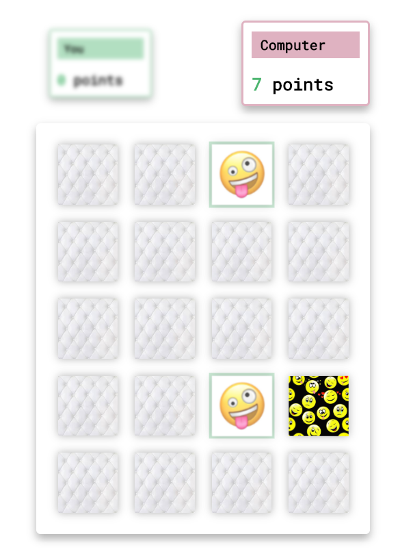

# Small Memory Game using JS and WEBPACK

### How to run

1. Install `nodejs`;
2. Install dependencies with command `npm install`;
3. Run `npm run start`.

### Game Example

### Game demonstration

[memory game](https://dominguetigs.github.io/memory-game/src)
